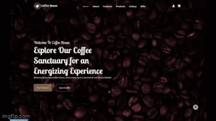

# Coffee Shop :coffee:

Welcome to Coffee Shop, your go-to destination for purchasing high-quality coffee beans and coffee equipment. This React application is designed to provide users with a seamless shopping experience, allowing them to explore a variety of products, add items to their cart, and conveniently check out at the end of their shopping spree. With an intuitive interface and a focus on user satisfaction. :coffee:
↳ [Project Link](https://coffee-shop-eight-indol.vercel.app)

---

## Project First Look

### Home Page

[<br>]
[](1.gif)

---

<!-- ### HomePage Demo -->

<!--  -->

## Features

|            Functions             | Detail                                                                                                                                                                                                                     | URL                          |
| :------------------------------: | -------------------------------------------------------------------------------------------------------------------------------------------------------------------------------------------------------------------------- | ---------------------------- |
|      Navigate to home page       | 1. User can view the home page                                                                                                                                                                                             | /\*                          |
|        View all products         | 1. User can scan through all the products in the product page <br>2.User can filter different categories of product through the left bar                                                                                   | /product_page                |
|   View single product details    | 1. User can view single product by entering the product id number in the url <br>2.User can select different variant of product <br>3.User can add product item to cart <br>4.User can view all items in the shopping cart | /product_page/:productBeanId |
| Check items in the Shopping Cart | 1. User can check all the products they added to the cart <br>2. User can remove product items in the shopping cart <br>3. User can increase or decrease the quantity of the item                                          | /cart                        |
|             Checkout             | 1.User can checkout by filling all the information of the form <br>2.User can choose different ways of shipping                                                                                                            | /checkout                    |
|           Manage order           | 1. User can manage their order by login with their email                                                                                                                                                                   | /order_management            |

---

## Installation

To run Coffee Shop locally on your machine, follow these steps:

### Clone the repository

```
$ git clone https://github.com/ailsayang999/coffee-shop.git
```

### Navigate to the project directory:

```
cd coffee-shop
```

### Install dependencies

```
npm install
```

### Start the development server

```
npm start
```

### Open your browser and go to http://localhost:3000 to view Coffee Shop.

---

## Dependencies

| Package           | version |
| :---------------- | :------ |
| react             | v18.2.0 |
| react-dom         | v18.2.0 |
| react-icons       | v4.11.0 |
| react-router-dom  | v6.17.0 |
| react-scroll      | v1.9.0  |
| sass              | v1.69.4 |
| styled-components | v6.1.0  |
| swiper            | v10.3.1 |

## Contributors

### Back end

[seangotjuice](https://github.com/seangotjuice) | [TinyMurky](https://github.com/TinyMurky)

### Front end

[ailsayang999](https://github.com/ailsayang999/coffee-shop)
